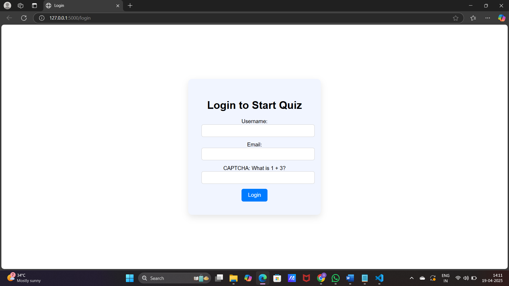
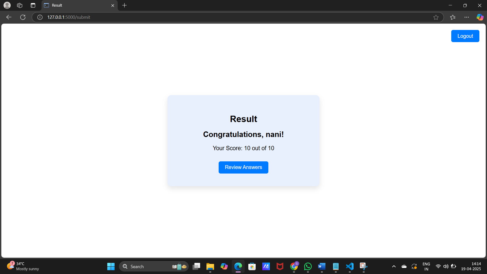

**🧠 Simple Quiz Website**

A beginner-friendly quiz website built using **HTML**, **CSS**, and **Python (Flask)**. It allows users to answer multiple-choice questions and get their score instantly after submitting the quiz.

** 🚀 Features**
- Multiple choice questions
- Auto-calculated score
- Responsive and clean UI
- Built with Flask (Python web framework)

## 📁 Project Structure

quiz-app/
├── app.py                  # Flask backend
├── templates/
│   ├── index.html          # Main quiz page
│   └── result.html         # Result display page
├── static/
│   └── style.css           # CSS styling
└── README.md               # Project documentation

** 🛠️ Requirements**

Make sure you have Python installed.

Install Flask:

**pip install flask**

** ▶️ How to Run**

1. Clone this repository:

**git clone https://github.com/your-username/quiz-app.git
cd quiz-app**

2. Run the Flask app:

**python app.py**

3. Open your browser and go to:

**http://127.0.0.1:5000**

** 📸 Screenshots**

**🧾 Quiz Page**

**🧮 Result Page**

**🧩 Future Improvements**
- Add a timer for the quiz
- Save user scores
- Add more question types (checkbox, dropdown, etc.)
- User login and history

## 📄 License

This project is open-source and free to use under the [MIT License](LICENSE).

## 🙌 Acknowledgements

Built with ❤️ using Python, Flask, HTML, and CSS.

### ✅ Tips:
- Replace `your-username` with your GitHub username in the clone link.
- Add screenshots for a nice visual if you're uploading it to GitHub.
- If you want to make it public, create a new repo and push it:

git init
git add .
git commit -m "Initial commit"
git branch -M main
git remote add origin https://github.com/your-username/quiz-app.git
git push -u origin main

